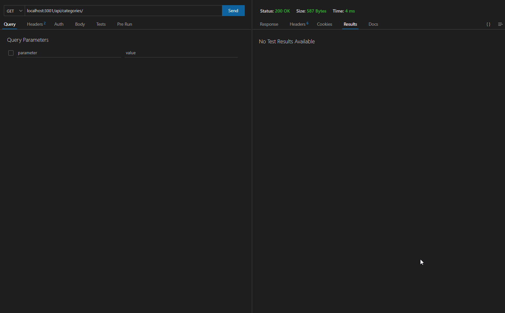

# ecommerce_backend

  [](https://opensource.org/licenses/MIT)

-----------------------

## Technology Used 🖥️

| Technology Used         | Resource URL           | 
| ------------- |:-------------:| 
| JavaScript | [https://developer.mozilla.org/en-US/docs/Web/JavaScript](https://developer.mozilla.org/en-US/docs/Web/JavaScript)     |  
| node.js | [https://nodejs.org/en](https://nodejs.org/en)     |     
| Express.js | [https://expressjs.com/](https://expressjs.com/)     |     
| Sequelize | [https://sequelize.org/](https://sequelize.org/)     |     
| dotenv | [https://www.npmjs.com/package/dotenv](https://www.npmjs.com/package/dotenv)     |     
| mysql2 | [https://www.npmjs.com/package/mysql2](https://www.npmjs.com/package/mysql2)     |     
| Git | [https://git-scm.com/](https://git-scm.com/)     |   

------------------

## Description 📝

This repo contains code for a fake ecommerce backend. 

Through the usage of mainly sequelize and mysql2, we're able to access MySQL databases, get information about products, create new entries in the database's tables, update information in our database, and delete information from our database.



-----------------------

## Table of Contents 📋
* [Learning Points](#learning-points-📖)
* [Installation Instructions](#installation-instructions-📥)
* [Usage Information](#usage-information-✅)
* [Author Info](#author-info-👺)
* [Questions?](#questions-❓)
* [License](#license-🚩)

----------------------

## Learning Points 📖

The biggest learning point through the creation of this application, for me, was the power of MySQL databases in applications as well as how to manipulate databases through JavaScript thanks to node modules such as Sequelize and MySQL2.

An example of how I accessed MySQL databases can be found below:

```JavaScript
router.put('/:id', async (req, res) => {
  // update a category by its `id` value
  try{
    const categoryData = Category.update(req.body, {
      where: {
        id: req.params.id
      }
    });
    if(!categoryData){
      res.status(400).json({message: 'No category with this id exists'})
    }
    res.status(200).json({message: 'Category has been updated'})
  }catch(err){
    res.status(500).json(err)
  }
});
```

To go into more detail about the code above, this code snippet represents my put route for my /api/categories/:id route.

This code will take the user given id (through req.params.id) and update the category entry whose id is the same as the user given id. The updated information is given through req.body (which is the user's input).

If the user chooses to update a category that isn't present in the category table (i.e. they give the wrong id), then it will tell the user that no category exists with the given id.

If the id exists, then the entry in the category table will be updated with whatever the user gives us. 

If everything else fails, it assumes that the server is dead and sends the 500 status.

----------------------

## Installation Instructions 📥

To install this application, follow the steps below:

1. Please make sure you have node.js installed on your computer
2. Download the contents of this repo on to your local machine or clone it down
3. Run `npm i` through your integrated terminal in the root folder of this repo

------------------------

## Usage Information ✅

To use this application, follow the steps below:

1. Open your integrated terminal in the root directory of this application
2. Run `npm run schema` and log in to your MySQL account
3. Run `\. db/schema.ql` 
4. Run `npm run seed`
5. Run `npm start` or `npm run watch`
6. Open Insomnia or Postman and make get, fetch, post, put, or delete requests to the routes outlined in the files

Alternatively, [you can also watch this video](https://youtu.be/aCjLXdkqKYs).

------------------------

## Author Info 👺

### ***daevidvo***
* [Github](https://www.github.com/daevidvo)
* [LinkedIn](https://www.linkedin.com/in/daevidvo)
* [Instagram](https://www.instagram.com/daevidvo)

--------------------------

## Questions ❓

Email me at: [daevidvo@gmail.com](mailto:daevidvo@gmail.com) or [visit my GitHub](https://www.github.com/daevidvo)

------------------------

## License 🚩

https://opensource.org/licenses/MIT


The MIT License (MIT)
=====================

Copyright © daevidvo

Permission is hereby granted, free of charge, to any person
obtaining a copy of this software and associated documentation
files (the “Software”), to deal in the Software without
restriction, including without limitation the rights to use,
copy, modify, merge, publish, distribute, sublicense, and/or sell
copies of the Software, and to permit persons to whom the
Software is furnished to do so, subject to the following
conditions:

The above copyright notice and this permission notice shall be
included in all copies or substantial portions of the Software.

THE SOFTWARE IS PROVIDED “AS IS”, WITHOUT WARRANTY OF ANY KIND,
EXPRESS OR IMPLIED, INCLUDING BUT NOT LIMITED TO THE WARRANTIES
OF MERCHANTABILITY, FITNESS FOR A PARTICULAR PURPOSE AND
NONINFRINGEMENT. IN NO EVENT SHALL THE AUTHORS OR COPYRIGHT
HOLDERS BE LIABLE FOR ANY CLAIM, DAMAGES OR OTHER LIABILITY,
WHETHER IN AN ACTION OF CONTRACT, TORT OR OTHERWISE, ARISING
FROM, OUT OF OR IN CONNECTION WITH THE SOFTWARE OR THE USE OR
OTHER DEALINGS IN THE SOFTWARE.
